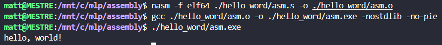

# Assembly no Windows 10 x64 com WSL

- [Assembly no Windows 10 x64 com WSL](#assembly-no-windows-10-x64-com-wsl)
  - [Fontes](#fontes)
  - [WSL2](#wsl2)
  - [Dependencias Linux](#dependencias-linux)
  - [Codificar em assembly](#codificar-em-assembly)
    - [Exemplo "Hello world!":](#exemplo-hello-world)
  - [Gerar o executavel assembly](#gerar-o-executavel-assembly)
  - [Observações](#observações)
  - [👨🏼‍💻AUTOR](#autor)

## Fontes
Código adaptado de código original feito por [Pedro Pessoa](https://github.com/phenpessoa): 
- [Youtube](https://www.youtube.com/watch?v=Rpq5PDDgwxU) 
- [Repositório](https://github.com/phenpessoa/yt-asm.git)

## WSL2
Realizar a instalação do wsl2 conforme o passo a passo:

[Instalar o Linux no Windows com o WSL](https://learn.microsoft.com/pt-br/windows/wsl/install)

1. Habilitar o Subsistema do Windows para Linux
    ```PowerShell
    dism.exe /online /enable-feature /featurename:Microsoft-Windows-Subsystem-Linux /all /norestart
    ```

2. Comando de instalação: 
    ```PowerShell
    wsl --install
    ```
3. Habilitar o recurso de Máquina Virtual:
    ```PowerShell
    dism.exe /online /enable-feature /featurename:VirtualMachinePlatform /all /norestart
    ```
4. **Baixar e instalar** o pacote de atualização do kernel do Linux:  
    [Pacote de atualização do kernel do Linux do WSL2 para computadores x64](https://wslstorestorage.blob.core.windows.net/wslblob/wsl_update_x64.msi)

5. Definir o WSL 2 como a sua versão padrão:
    ```PowerShell
    wsl --set-default-version 2
    ```

6. Instalar a distribuição do Linux:
    ```PowerShell
    wsl --install -d Ubuntu
    ```

7. Comando para verificar a versão:
    ```PowerShell
    wsl -l -v
    ```
## Dependencias Linux
1. Atualizar o update:
   ```bash
   sudo apt-get update
   ```
2. Baixar e instalar o GCC:
   ```bash
   sudo apt install gcc
   ```
3. Baixar e instalar o NASM:
   - Site: [https://www.nasm.us/](https://www.nasm.us/);
   - Clicar na ultima versão estavel (Stable);
   - Baixar o arquivo "nasm-2.16.02.tar.gz";
   - Ir até a pasta onde foi feito o download pelo terminal (utilizar cd "incluir caminho onde esta o arquivo")
   - Descompactar o arquivo utilizando o comando: "tar -xvzf nasm-2.16.02.tar.gz";
    - Executar o arquivo "./configure";
    - Executar o comando "make";
    - Executar o comando "sudo make install";
    - Confirmar a instalação com o comando: "nasm --version"
  
4. Adaptação para funcionar codigos de 32 bits:
    ```bash
    sudo apt install qemu-user-static
    sudo update-binfmts --install i386 /usr/bin/qemu-i386-static --magic '\x7fELF\x01\x01\x01\x03\x00\x00\x00\x00\x00\x00\x00\x00\x03\x00\x03\x00\x01\x00\x00\x00' --mask '\xff\xff\xff\xff\xff\xff\xff\xfc\xff\xff\xff\xff\xff\xff\xff\xff\xf8\xff\xff\xff\xff\xff\xff\xff'
    sudo dpkg --add-architecture i386
    sudo apt install gcc:i386
    ```

Você precisará reativá-lo sempre que reiniciar o WSL e quiser suporte ao i386:
```bash
sudo service binfmt-support start
```

## Codificar em assembly
Criar um arquivo com a extensão ".s" (essa extensão não é obrigatório, mas é uma convenção);
Incluir todo o codigo em assembly.

### Exemplo "Hello world!":

```assembly
global _start

_start:
    CALL print_hello_world
    JMP exit

print_hello_world:
    MOV rax, 1              ; Número da chamada do sistema para escrever
    MOV rdi, 1              ; Código de saída com definição da instrução 0 strin, 1 stdout, 2 strerror
    LEA rsi, [hello_str]    ; LOAD EFECTIVE ADDRESS, passando um ponteiro para o registrador rsi
    MOV rdx, 14             ; movendo a quantidade de caracteres para o registrador rdx
    SYSCALL                 ; Invoca a chamada de sistema
    RET                     ; Retorna para quem chamou

exit:
    MOV rax, 60         ; Número da chamada de sistema para sair
    MOV rdi, 0          ; Código de saída (0 neste caso)
    SYSCALL             ; Invoca a chamada de sistema

section .data
    hello_str db 'hello, world!', 0x0A  ; String com quebra de linha

```


## Gerar o executavel assembly
```bash
nasm -f elf64 filename.s -o filename.o
gcc filename.o -o filename.exe -nostdlib -no-pie
./filename
```

## Observações
1. O executavel gerado só funciona no WSL;
2. Estou utilizando um processador: 11th Gen Intel(R) Core(TM) i5-11300H @ 3.10GHz   3.11 GHz
3. Saída em meu console:
   
   

## 👨🏼‍💻AUTOR
<a href="https://github.com/MatheusLPolidoro" style="align: center" width="90px">
<a href="https://github.com/MatheusLPolidoro" style="align: center" width="90px">
<a href="https://github.com/MatheusLPolidoro" style="align: center" width="90px">  
  
<p align="center">
  
  </br>🧑🏼 <a href="https://github.com/MatheusLPolidoro"> Matheus Polidoro</a>
</p>
