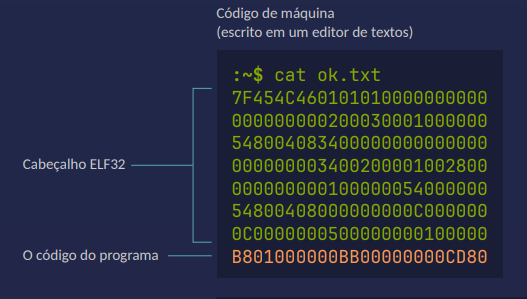
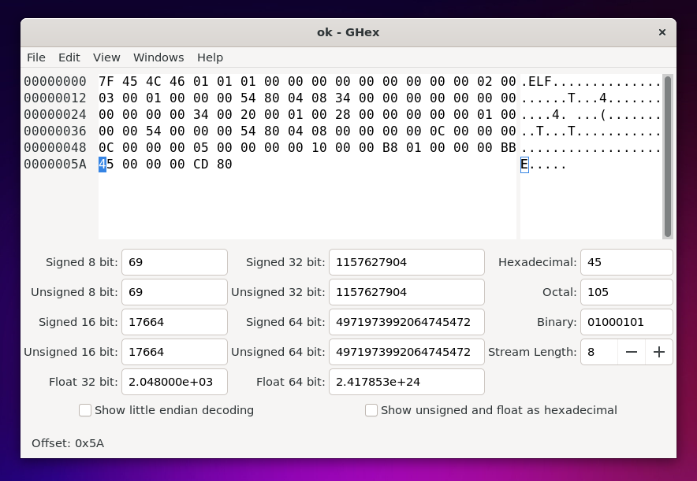

# Código de Máquina 🖥️

Estudo feito embasado na playlist: **Fundamentos de assembly x86-64**<br>

✍️ Autor [Blau Araujo](https://codeberg.org/blau_araujo)<br>
🗒️ Repositório: [codeberg](https://codeberg.org/blau_araujo/assembly-nasm-x86_64/src/branch/main/pdf/aula01.pdf)<br>
📽️ Playlist videos: [Youtube](https://www.youtube.com/watch?v=Ej6U-qk0bdE&list=PLXoSGejyuQGohd0arC7jRBqVdQqf5GqKJ) 

## Conceitos importantes :books:
- Instruções são números;
- Dados são números;
- Endereços são números;
- Interrupções são números;
- Chamadas de sistema são números.
  
Se a CPU só trabalha com números, os **números** são a **linguagem da máquina!**

## Transformando números em programa (WSL)
- Em um arquivo de texto (.txt), incluso todo o código de máquina, com números em HEX (hexadecimal), sendo que sempre trabalha com BYTES, cada 2 números são equivalentes a 8 BITS, ou seja, 1 BYTE:

    
- Executar o programa 'xxd' (Xdump) para gerar o arquivo binário (executavel), fazendo o despejo inverso do arquivo de texto, sendo os parametros -p: plain (puro) -r: reverse operation (operação inversa para binario):
    ```bash
    xxd -p -r filename.txt > filename
    ```
- Fornecer permisão para execução ao arquivo:
    ```bash
    chmod +x filename
    ```
- Verificação do formato do arquivo gerado, utilizando o utilitario 'file':
    ```bash
    file filename
    ```
- Output:
    ```bash
    ELF 32-bit LSB executable, Intel 80386, version 1 (SYSV), statically linked, no section header
    ```
- Exibição do conteúdo binário:
    ```bash
    xxd -c 12 -g 1 filename
    ```
- Output:
    ```bash
    00000000: 7f 45 4c 46 01 01 01 00 00 00 00 00 00 00 00 00  .ELF............
    00000010: 02 00 03 00 01 00 00 00 54 80 04 08 34 00 00 00  ........T...4...
    00000020: 00 00 00 00 00 00 00 00 34 00 20 00 01 00 28 00  ........4. ...(.
    00000030: 00 00 00 00 01 00 00 00 54 00 00 00 54 80 04 08  ........T...T...
    00000040: 00 00 00 00 0c 00 00 00 0c 00 00 00 05 00 00 00  ................
    00000050: 00 10 00 00 b8 01 00 00 00 bb 00 00 00 00 cd 80  ................
    ```
- Executar o programa gerado e verificar o ultimo status code:
    ```bash
    ./filename
    echo $?
    ```
- Output:
    ```bash
    0
    ```

### Sobre o Programa :ballot_box_with_check:
Este programa é identico a um programa chamado true para sistemas GNU linux, que fica em uma pasta ./bin/true, que tem a única função de retornar um stado de termino, sendo este um número entre 0 e 255, onde 0 é **sucesso** e qualquer outro número é considerado um **erro**, nós não vemos esse retorno, porém ele é informado ao shell, que registra este estado de termino, e assim conseguimos ver o ultimo estado de termino lançado no sistema.

### Editar um Arquivo Binario 🔢
Após gerar um arquivo binário, ainda é possivel editar ele utilizando algum programa de edição de hexadecimal.

- Instalação do ghex e utilização:
  ```bash
  sudo apt install ghex
  ghex filename
  ```
- Abrir o programa e alterar o BYTE correto para trocar o status de retorno desse programa:
    

- Como foi incluso o número HEX 45, agora o stado de termino que o programa retorna é o número decimal 69, que corresponde ao caracter ASCII "E":
   ```bash
   ./machine_code/ok ; echo $?
   ```
- Output:
    ```bash
    69
    ```